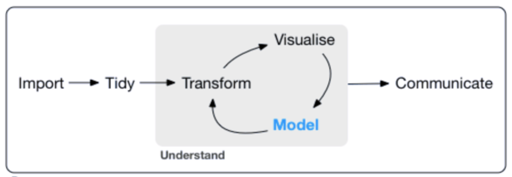

## Programa para hoje

- Apresentação do Programa do Curso
- Por quê o R e o RStudio? 
- Funções básicas
- Scripts, objetos
- Obtendo ajuda

## Apresentação do Programa do Curso


## Pipeline

<center>
{width=700px}
</center>

## 

<center>

{width=200px}


</center>

## Por quê o R? 

- Linguagem de programação de código aberto
- Construída por estatísticos (isso é bom e ruim)
- Ampla comunidade 

## Comunidade

- [R-Bloggers](https://www.r-bloggers.com/)
- [R-Ladies Global](https://rladies.org/)
- [R-Ladies SP](https://www.meetup.com/pt-BR/R-Ladies-Sao-Paulo/)
- [Minas Programam](https://minasprogramam.com/quem-faz/)

## Por quê o RStudio? 

<center>
{width=800px}
</center>

## Por que o R e o RStudio? 

<center>
{width=700px}
</center>

## O básico: R como uma calculadora!

```{r eval=FALSE, echo=TRUE}
# Qual é o resultado?
2 + 9 * 4
4 + 3 / 10^2
pi - 3

# Notação científica
5 * 10^2
5 * 10^-2
111111 * 111111
1111111 * 1111111
```

## Objetos

```{r}
# Qual é o valor de a?
a <- 4
a <- a * 5
a <- a + 10
a <- seq(a, 100, 5)
```

Podemos criar vários objetos de uma vez:
```{r}
x <- y <- z <- w <- pi
```

Agora nós criamos um monte de objetos na memória do R. Vamos apagá-los para nosso ambiente não ficar bagunçado
```{r}
rm(list = ls())
```

## Vetores

```{r}
numeros <- c(1, 4, 10, pi, 1/3)
texto <- c("a", "b", "FRB", "Rio Branco")
(tudo_junto <- c(numeros, texto)) # tudo entre parênteses para mostrar  conteúdo do objeto
```

Note que, quando juntamos números e texto, **todos os elementos viram texto**. 
Vamos tratar das particularidades de texto mais para a frente.

## Onde obter ajuda?

<center>
{width=400px}
</center>

## Onde obter ajuda?

A função `sum()` é frequentemente útil. Ela permite somar vetores. 
Vamos aproveitar para consultar a **documentação** desta função através de outra 
função, a função `?`.

```{r message=FALSE, warning=FALSE, results='asis'}
?sum()
```

## Onde obter ajuda?

Além da documentação oficial do R, uma referência muito valiosa é o [Stack Overflow](https://stackoverflow.com/)

<center>
{width=800px}


[useR!2017: We R What We Ask - Video!](https://channel9.msdn.com/Events/useR-international-R-User-conferences/useR-International-R-User-2017-Conference/We-R-What-We-Ask-The-Landscape-of-R-Users-on-Stack-Overflow)

</center>

## Material adicional

<center>
{width=600px}


[swirl teaches you R programming and data science interactively](https://swirlstats.com/)
</center>


## Material adicional
<center>
{width=600px}


[RStudio Primers](https://rstudio.cloud/learn/primers)

</center>


## Tarefa da aula

Instale o R e o RStudio na sua máquina, e rode os comandos desta apresentação para ter certeza de que está tudo certo.

[Site do R](https://www.r-project.org/)

[Site do RStudio](https://rstudio.com/)

[Tutorial de instalação](https://rpubs.com/cassiorampinelli/488999)

