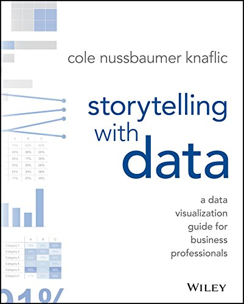

## Fluxo da ciência de dados
Percorremos um longo caminho nessas duas semanas. Hoje completamos o ciclo.

## A floresta e as árvores

{width=400}

Exploramos muitos detalhes de implementação nesses últimos dias. Nos concentramos em aspectos individuais de cada análise.

Hoje, queremos dar um passo atrás para pensarmos **menos no detalhe** e **mais no processo**.

No fim da contas, toda análise de dados tem um propósito. Como alcançá-lo de maneira mais efetiva?

## Elementos essesenciais da comunicação de dados

Vamos separar o processo de comunicação de dados em 6 princípios gerais:

1. O contexto importa
2. A visualização deriva dos dados
3. Separar o que é sinal e o que é ruído
4. Impor hierarquia entre os dados
5. Beleza também conta
6. Sua análise deve contar uma história

## Contando sua história

## Amarrando todos os passos

Vamos contar uma história partindo do gráfico abaixo, fazendo passo a passo as adaptações sobre as quais conversamos. O que ele está te dizendo?

{width=500px}

## Amarrando todos os passos

## Amarrando todos os passos

## Amarrando todos os passos

## Amarrando todos os passos

## Narrativa final

## Narrativa final

## Narrativa final

## Narrativa final

## Narrativa final

## Narrativa final

## Narrativa final

## Narrativa final

## Antes e depois

## Referência

