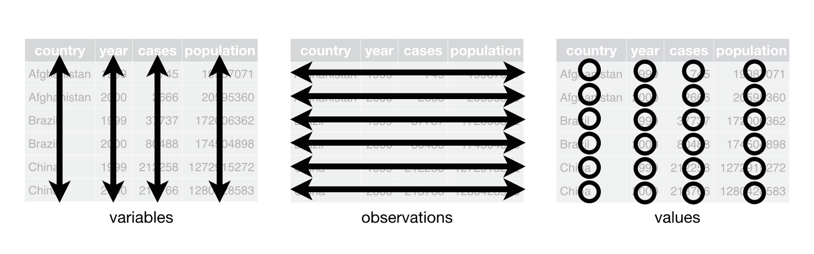

## Revisão de ontem
```{r eval=FALSE, echo=TRUE}
# Qual é o resultado?
2 + 9 * 4
4 + 3 / 10^2
pi - 3

# Qual é o valor de a?
a <- 4
a <- a * 5
a <- a + 10
a <- seq(a, 100, 5)
```

## Funções
Funções são o arroz-com-feijão da programação estatística no R. 
Muitas das análises que vamos fazer no curso tem como fundamento o uso de funções 
corretas e a identificação dos **argumentos** apropriados para cada caso.

Nós já vimos alguns exemplos de funções na primeira aula:

```
install.packages("tidyverse") # instala pacotes
library() # carrega pacotes na memória
sessionInfo() # Informações sobre a versão do R
```

O principal uso das funções é automatizar operações que, se fossem feitas 
manualmente, demorariam muito tempo, estariam sujeitas a erros ou simplesmente 
seriam muito tediosas.

## Funções
Por exemplo, se precisarmos achar a média entre dois números, poderíamos fazer o cálculo manualmente

```{r}
(35 + 65)/2
```

Mas se tivéssemos 1000 números em vez de 2, esse processo seria extremamente longo e cansativo. Assim, podemos simplesmente usar a função `mean()` para calcular a média de todos os números de 1 a 1000

```{r}
mean(1:1000)
```

## Funções
O R possui inúmeras funções para fazer todo tipo de cálculo que vocês possam imaginar 
(e também o que vocês nem conseguem imaginar). Ainda assim, à medida que vocês avançam 
no uso, haverá a necessidade de fazer tarefas específicas, para as quais nenhuma função 
existente é satisfatória. Nesses momentos fica evidente a vantagem de o R ser uma 
linguagem de programação, pois podemos **criar nossas próprias funções**. 

Por enquanto, vamos explorar algumas funções que já existem no R. Vocês perceberam 
que não precisei digitar todos os números de 1 a 1000 no slide anterior?

```{r}
numeros <- 1:1000
numeros_desc <- 1000:1 
```

Muito mais fácil do que `numeros <- c(1, 2, 3, ..., 1000)`

## Funções
Mas e se eu quisesse tirar a média dos números ímpares de 1 a 1000? Teria que digitar os números um a um?

Nesses momentos é bom lembrar que a **preguiça** é um dos traços que separam os bons programadores dos demais. Quase todas as tarefas tediosas e repetitivas na programação podem ser automatizadas de alguma maneira.

Obviamente, o R tem a função `seq()` que nos permite criar um vetor de números ímpares. Note como são utilizados os argumentos da função.

```{r}
impares <- seq(from = 1,  to = 1000,  by = 2)
mean(impares)
```

## Funções
O R vem pré-instalado com diversas funções estatísticas -- afinal, essa é uma de suas razões de existir. Além da função `mean()`, que vimos no slide anterior, podemos olhar também para outras estatísticas descritivas

```{r results='hide'}
sd(impares) # desvio-padrão
var(impares) # variância
range(impares) # amplitude
IQR(impares) # intervalo interquartil
```

O comando `summary()` nos dá uma visão geral sobre esse vetor

```{r}
summary(impares)
```


## Vetores

```{r}
numeros <- c(1, 4, 10, pi, 1/3)
texto <- c("a", "b", "FRB", "Rio Branco")
(tudo_junto <- c(numeros, texto)) # tudo entre parênteses para mostrar  conteúdo do objeto
```

Note que, quando juntamos números e texto, **todos os elementos viram texto**. 

## Dataframes

Podemos pensar nos dataframes como **coleções de vetores** dispostos lado a lado. 
É, de longe, o formato  mais utilizado para a análise e processamento de dados. 

```{r results='hide'}
nomes <- c("Rafael", "Davi", "Ana", "Pedro")
formacao <- c("Ciência Política", "RI", "Adm Publica", "RI")
tempo_empresa <- c(3, 10, 10, 1)

equipe <- data.frame(nomes, formacao, tempo_empresa)

nrow(equipe) # número de linhas
ncol(equipe) # número de colunas
head(equipe) # primeiras obs
summary(equipe) # resumo dos dados
```

O `R` tem suporte para outras estruturas de dados como matrizes e listas, 
que veremos conforme a necessidade.

## Tidy data
- Observações nas linhas
- Atributos nas colunas
- Valores nas células



## Subsetting para vetores
As ferramentas que vamos ver agora servem para "pinçar" informações que estã na 
memória do R. Voltando ao vetor de números ímpares que criamos mais cedo, suponha 
que eu queira saber o valor do 287º elemento

```{r results='hide'}
impares <- seq(from = 1,  to = 1000,  by = 2)
impares[287]
```

Podemos expandir o operador `[` para diversas seleções, de acordo com a necessidade

```{r results='hide'}
impares[c(1, 76, 48)] # seleção de diversos números
impares[-c(1:250)] # todos os números menos os 250 primeiros
impares[impares > 900] # apenas valores maiores que 900
```

Note que **sempre** podemos guardar os resultados dessas operações em um novo objeto

```{r results='hide'}
selecao_impares <- impares[c(1, 76, 48)] # seleção de diversos números
```

## Subsetting para dataframes
O funcionamento do operador `[` é semelhante para dataframes, mas precisamos atentar para as dimensões de linhas e colunas

```{r results='hide'}
equipe[1, 3] # linha 1, coluna 3
equipe[1,] # retorna toda a linha 1
equipe[,3] # retorna toda a coluna 3
equipe[,c(1, 3)] # retorna as colunas 1 e 3
```

A diferença é que, com dataframes, é muito comum utilizarmos o operador `$` para selecionar colunas
```{r results='hide'}
equipe$tempo_empresa # seleciona a variável "tempo de empresa"
equipe[,3] # mesmo resultado
```

## Operadores Lógicos

Para seleções mais complexas, é comum que se precise recorrer a operadores lógicos. 

<center>
{width=800px}
</center>

## Operadores Lógicos

Os mais comuns são `&` e `|`, mas todos os operadores relacionais também são 
reconhecidos: `==` (igual a), `!=` (diferente de), `>` (maior que), `<` (menor que), 
`>=` (maior ou igual que), `<=` (menor ou igual que)

```{r results='hide'}
equipe[equipe$tempo_empresa == 10,] # apenas as pessoas com 10 meses de empresa
equipe[equipe$tempo_empresa < 5,] # apenas as pessoas com menos de 5 meses de empresa
equipe[equipe$tempo_empresa < 5 | equipe$formacao == "Adm Publica",] # menos de 5 meses de empresa OU fazem adm pública
equipe[equipe$tempo_empresa > 2 & equipe$tempo_empresa < 5,] # entre 2 e 5 meses de empresa
```

## Importanto dados

Como adiantamos na abordagem de projetos no `RStudio`, um excelente pacote para 
auxiliar na tarefa de navegação no diretório do projeto é o pacote `here`. 

A função que dá nome ao pacote é usada para direcionar o seu programa à pasta correta no 
diretório do projeto. Vejamos o exemplo: 

```{r eval=FALSE, message=FALSE, warning=FALSE}
library(here)
library(tidyverse)
wb <- read_csv2(here("wb-brazil.csv"))

```

**Obs**: O Banco Mundial publica os dados de seus projetos. Os dados acima foram obtidos 
através de download e seleção de algumas colunas da lista de projetos ativos no Brasil. 
Você encontra a lista completa [aqui](https://projects.worldbank.org/en/projects-operations/projects-list?lang=en&searchTerm=&countrycode_exact=BR)!

## Exportando dados

Suponha que após você carregar a base de dados, realizou tarefas que mudaram sua 
configuração e você deseja salvá-las sem reescrever a base original.

```{r eval=FALSE, message=FALSE, warning=FALSE}
write_csv2(wb, here("wb-brazil-filter.csv"))

```

## Atividade
Utilizando o banco de dados disponível no Moodle, identifique o valor médio dos projetos do Banco Mundial.

Salve o seu código em um arquivo .R e faça o upload no Moodle

