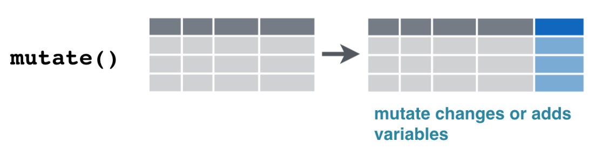
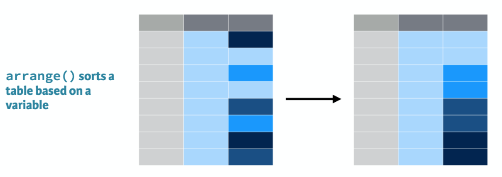

## Motivação

- Uma organização internacional (OI) tem o interesse de desenvolver projetos de promoção 
de direitos humanos em diferentes regiões do globo. 
- Sua grande preocupação é cuidar para que desde o início a formulação dos projetos considere
caracteríticas regionais relacionadas à religião e o regime político estabelecido.

## Banco de dados: Quality of Government 

Vamos utilizar o [Quality of Government](https://qog.pol.gu.se/) para selecionar 
algumas características importantes dos sistemas políticos de diferentes países.

Trata-se de um projeto que organiza diferentes bases de dados relacionados a 
Política Comparada e Relações Internacionais, facilitando análises de n grande. 
Vale a pena olhar o livro de códigos!

## Carregando dados

- Vamos carregar a principal base de dados dessa aula usando a função `read_csv` e
alocá-la num objeto chamado `qog`:

```{r eval=FALSE, echo=TRUE}
library(here)
library(readr)

# importando base de dados
qog <- read_csv(here("qog_bas_ts_jan20.csv"))

```

## Carregando dados: outras possibilidades

Praticamente todo tipo de estrutura de dados pode ser importada para análise no `R`. 
Os seguintes pacotes `tidyverse` são recomendados:

- `haven`: para formatos SPSS, Stata, e SAS.
- `readxl`: para arquivos do Microsoft Excel (.xls e .xlsx).
- `DBI`: para RMySQL, RSQLite, RPostgreSQL, etc.
- `jsonlite`: para json.
- `xml2` para XML. 

## 
<center>
> “Happy families are all alike; every unhappy family is unhappy in its own way.”
>
> --- Liev Tolstoi

> “Tidy datasets are all alike; every messy dataset is messy in its own way.”
>
> --- Hadley Wickham

</center>

## Tidy Data vs. Messy Data


- No mundo real, a grande maioria dos dados não vai estar no formato que desejamos. 
Nessa aula vamos aprender a processar os dados para que eles fiquem *tidy* de acordo com 
nossos objetivos.

## *Tidyverse*
Todas as  ferramentas que vamos ver fazem parte do [tidyverse](https://www.tidyverse.org/), 
um conjunto de pacotes para tratamento de bases de dados.

```{r message=FALSE, warning=FALSE}
# install.packages("tidyverse")
library(tidyverse)
```

Esse conjunto de pacotes segue um conjunto de princípios que estão se tornando o 
padrão de análise de dados no `R`.

<center>
{width=600px}
</center>

<center>
[The tidy tools manifesto](https://cran.r-project.org/web/packages/tidyverse/vignettes/manifesto.html)
<center>

## 
<center>
{width=300px}
</center>

O *pipe* (`%>%`) deixa a ordem das operações mais clara, tornando o código mais 
fácil de ler e de compreender.

```{r eval=FALSE, echo=TRUE}
# Um vetor qualquer
x <- c(1:10)

# Um cálculo simples com código complicado
sum(sqrt(factorial(x)))

# O mesmo cálculo com %>% 
x %>% factorial() %>% sqrt() %>% sum()
```


## Verbos
No `tidyverse` vamos tratar de **verbos** (funções) que descrevem passo-a-passo as 
tarefas de processamento necessárias:

- Selecionar casos com `filter()`
-  Ordenar variáveis com `arrange()`
-  Processar colunas com `select()` e `rename()`
-  Criar variáveis com `mutate()`
-  Recodificar variáveis com `case_when()`
-  Resumir informações com `summarise()` e `group_by()`
-  Reorganizar bases com `pivot_wider()` e `pivot_longer()`
-  Mesclar bases com `left_join()`
-  Combinar diferentes passos de processamento
-  Aplicação

## Selecionar colunas com `select()`
Em uma bases de dados com um número muito grande de colunas, você pode querer 
selecionar apenas aquelas que são mais importantes para uma determinada tarefa.

```{r eval=FALSE, message=FALSE, warning=FALSE, results='hide'}
# Selecionar apenas variáveis de democracia
qog %>% 
  select(cname, chga_demo, p_polity2)

# Selecionar todas as colunas menos duas
qog %>% 
  select(-(3:4))
```

## Selecionar colunas com `select()`

```{r eval=FALSE, message=FALSE, warning=FALSE, results='hide'}
# Algumas funções mais específicas
banco_mundial <- qog %>% 
  select(starts_with("wb"))

welfare <- qog %>% 
  select(ends_with("_wel"))

# Alterar a ordem de apresentação das variáveis
qog <- qog %>% 
  select(chga_demo, p_polity2, everything())

```

## Renomear variáveis com `rename()`
A função `rename()` é prima da `select()`. Com ela, conseguimos trocar o nome de uma variável (`select()` também faz isso, mas apaga todas as outras variáveis do banco)

```{r eval=FALSE, message=FALSE, warning=FALSE, results='hide'}
# IMPORTANTE: o novo nome da variável vem primeiro
qog %>% 
  rename(democracia = chga_demo) %>% 
  select(cname, democracia)

```

## Criar variáveis com `mutate()`
<center>
{width=500px}
</center>

Esse é um dos comandos mais úteis de todo pacote. Frequentemente, as bases de dados não têm 
todas as informações que queremos, mas podemos criar nossas próprias variáveis a partir das
já existentes.

```{r eval=FALSE, message=FALSE, warning=FALSE, results='hide'}
# Note que as variáveis ccode e year continuam no banco de dados
qog %>% 
  mutate(ID = paste0(ccode, "/", year)) %>% 
  select(cname, ID)

# O comando transmute faz a mesma coisa, mas só mantém a variável nova
qog %>% 
  transmute(ID = paste0(ccode, "/", year))

```

## Recodificar variáveis com `case_when()`
Uma das funções mais úteis para ser usada com o `mutate()` é o `case_when()`. Com ela, 
podemos recodificar nossas variáveis para criar faixas de idade, salário, sexo, etc. 

**Importante**: sempre opere do caso específico para o geral.

```{r eval=FALSE, message=FALSE, warning=FALSE, results='hide'}
# Criar variável dummy para reclassificação do Polity IV
qog %>% 
  mutate(pol_bin = case_when(p_polity2 >= 7 ~ "Democracia",
                             TRUE ~ "Autocracia")) %>% 
  select(cname, pol_bin, p_polity2)

# Podemos ter mais de duas condições
qog %>% 
  mutate(pol_cat = case_when(p_polity2 > 7 ~ "Muito Democrático",
                             p_polity2 > 5 & p_polity2 <= 7 ~ "Democrático",
                                   TRUE ~ "Autocracia")) %>%
    select(cname, pol_cat, p_polity2) %>% arrange(desc(p_polity2))

```


## Selecionar casos com `filter()`
<center>
{width=700px}
</center>

O comando `filter()` **seleciona observações**, como o filtro do Excel.

```{r eval=FALSE, message=FALSE, warning=FALSE, results='hide'}
qog %>% 
  filter(year == 2015)
```

## Relembrando os operadores lógicos
<center>
{width=500px}
</center>

Podemos usar operadores lógicos para aplicar filtros com múltiplos critérios, 
assim como armazenar os resultados em um novo objeto.

```{r eval=FALSE, echo=TRUE}
qog %>% 
  filter(year == 2000 & chga_demo == 1) %>%
  select(cname, year, chga_demo)

```


## Ordenar variáveis com `arrange()`
<center>
{width=400px}
</center>

O comando `arrange()` ordena o banco de dados com base na variável que você selecionar. 
Variáveis adicionais serão usadas como critério de desempate

```{r eval=FALSE, message=FALSE, warning=FALSE, results='hide'}
# Ordenamento padrão é ascendente
qog %>% 
  arrange(chga_demo, p_polity2) %>%
  select(cname, year, p_polity2)

# Ordenamento descendente
qog %>% 
  arrange(desc(p_polity2)) %>%
  select(cname, year, p_polity2)
```

## Atividade
Carregue a base de dados do Quality of Government e crie um objeto contendo os 20 países com maior nota de democracia no ano de 2017. 

Esse objeto deverá ter, portanto, 20 linhas e 2 colunas (nome do país e nota)

