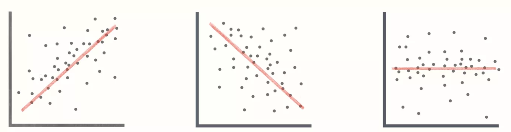
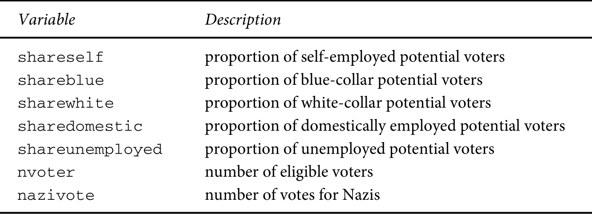

## Motivação

Nas eleições de Julho de 1932, o Partido Nazista se transformou na maior bancada do 
Parlamento alemão (ainda que não tenha ganho maioria). Quem os elegeu? Como podemos 
entender os valores desses eleitores por meio de pesquisas amostrais? E como podemos 
fazer comparações precisas sobre os grupos que demonstraram maior apoio ao partido?

## Correlação
<center>
{width=900px}
</center>

## Correlação
O coeficiente **r de Pearson** é uma medida específica de associação, a mais conhecida 
entre diversas outras. É uma medida de covariância padronizada, de modo que os valores 
sempre são restritos entre -1 e 1. Esse coeficiente é linear por construção, e vai tentar 
traçar uma reta mesmo que a nuvem de dados tenha um formato não linear.

$$
r = \sum_{i=1}^{n} \frac{cov(x,y)}{\sigma_{x}\sigma_{y}}
$$

## Associação
Lembram da variância?

$$
\sigma^{2} = \sum_{i=1}^{n}\frac{(x_{i} - \bar{x})^{2}}{N} = \sum_{i=1}^{n}\frac{(x_{i} - \bar{x}) * (x_{i} - \bar{x})}{N}
$$

Dizemos que duas variáveis estão associadas quando elas **variam conjuntamente**, tanto 
faz se na mesma direção ou em direções diferentes. Quando não há variação em uma das 
variáveis, não conseguimos, do ponto de vista estatistico, avaliar se há 
associaçao. **Variação é informação!**

$$
cov(x, y) = \sum_{i=1}^{n}\frac{(x_{i} - \bar{x}) * (y_{i} - \bar{y})}{N}
$$

## Correlação
Quando encontramos associação entre duas variáveis, não conseguimos distinguir se:

- $X$ influencia $Y$
- $Y$ influencia $X$
- $X$ e $Y$ se influenciam mutuamente
- $Z$ influencia $X$ e $Y$ (variável omitida)

## Correlação não é causalidade
<center>
{width=900px}
[Exemplos de correlações espúrias](https://www.tylervigen.com/spurious-correlations)

</center>

## Correlação não é causalidade
Para concluir que

$$X \longrightarrow Y$$

precisamos estabelecer três condições:

- **Ordem temporal**: $Y$ não pode acontecer antes de $X$. É a condição de mais 
fácil verificação.
- **Associação**: $X$ e $Y$ devem variar mutuamente. Avaliada com as ferramentas 
que vimos até agora no curso.
- <span class="red">**Eliminação de alternativas**</span>: todas as outras explicações 
plausíveis para $Y$ são descartadas. É a condição mais difícil de verificar.

## Regressão: modelagem e especificação

## *Del Rigor en la Ciencia*

En aquel Imperio, el Arte de la Cartografía logró tal Perfección que el mapa de una sola Provincia ocupaba toda una Ciudad, y el mapa del Imperio, toda una Provincia. Con el tiempo, estos Mapas Desmesurados no satisficieron y los Colegios de Cartógrafos levantaron un Mapa del Imperio, que tenía el tamaño del Imperio y coincidía puntualmente con él.

Menos Adictas al Estudio de la Cartografía, las Generaciones Siguientes entendieron que ese dilatado Mapa era Inútil y no sin Impiedad lo entregaron a las Inclemencias del Sol y los Inviernos. En los desiertos del Oeste perduran despedazadas Ruinas del Mapa, habitadas por Animales y por Mendigos; en todo el País no hay otra reliquia de las Disciplinas Geográficas.

Suárez Miranda, Viajes de Varones Prudentes, Libro Cuarto, Cap. XLV, Lérida, 1658.

--- Jorge Luis Borges ([wiki](https://pt.wikipedia.org/wiki/Jorge_Luis_Borges))


## Modelagem
<center>
> All models are wrong, but some are useful.
> 
> --- George Box

{width=600px}
</center>

## Afinal, o que significa "modelar" os dados?
Vamos começar com uma premissa bastante simples: para modelar, precisamos explicitar 
quais são as condições sob as quais uma variável $X$ se relaciona com uma variável $Y$. 
Para fins de nomenclatura, vamos começar a dar nomes específicos para essas variáveis:

- **Variável Dependente (VD)**: é o nosso fenômeno de interesse, usualmente denotada como $Y$
- **Variável Independente (VI)**: é o fenômeno que explica nossa variável dependente, 
que geralmente denotada como $X$

## Afinal, o que significa "modelar" os dados?
Matematicamente, vamos modelar $Y$ como uma *função* de $X$. Estatisticamente, a 
modelagem geralmente pode servir para dois objetivos principais:

1. **Predição**: usada para investigar a possibilidade de usar os valores de $X$ para 
prever o valor de $Y$. Não precisa haver uma conexão substantiva entre essas duas variáveis, 
contanto que uma sirva para gerar previsões confiáveis sobre os valores de outra. 
2. **Explicação**: usada para entender a conexão e a significância (substantiva e estatística) 
da relação entre duas variáveis. Neste caso, queremos estimar com precisão o impacto de uma variável 
sobre a outra, de preferência excluindo as possíveis variáveis omitidas.

## Modelo linear

O modelo OLS permite verificar a associação entre dois fenômenos mantendo constantes 
outras explicações possíveis, que chamamos de variáveis de controle. Trata-se de um **modelo linear**, 
mas veremos como flexibilizar essa suposição logo mais. Por enquanto, cabe lembrar 
que a forma funcional da regressão nada mais é do que uma equação:

$$y = \beta{_0} + \beta{_1} x{_1} + \ldots + \beta{_k} x{_k} + \epsilon$$

## Modelo linear
Nessa equação, os valores de $y$ e de $x_{1} \ldots x{_k}$ são conhecidos, e os 
valores de $\beta_{0} \ldots \beta_{k}$ são as incógnitas. Quando temos apenas uma 
variável independente, podemos estimar o valor de $\beta$ de maneira simples:

$$\hat{\beta} = \frac{\sum_{i=1}^{n}(x_{i} - \bar{x})(y_{i} - \bar{y})}{\sum_{i=1}^{n}(x_{i} - \bar{x})^{2}}$$

Geralmente, porém, temos um conjunto de variáveis independentes, com muito mais incógnitas. 
Nesses casos, precisamos resolver um sistema de equações:

$$\boldsymbol{\hat{\beta}} = (X^{\prime}X)^{-1}X^{\prime}y$$


## Eleições de 1932 na Alemanha

Vamos analisar as eleições de 1932 na Alemanha, na qual o Partido Nazista conseguiu 
pela primeira vez se transformar no maior partido da República de Weimar. 

```{r eval=FALSE, message=FALSE, warning=FALSE}
library(readr)
library(here)

nazis <- read_csv(here("nazis.csv"))
```

```{r echo=FALSE, message=FALSE, warning=FALSE}
library(readr)
library(here)

nazis <- read_csv(here("Aula 8/nazis.csv"))
```
Nosso banco de dados tem as seguintes variáveis:



## Eleições de 1932 na Alemanha
Vamos começar estimando o seguinte modelo:

$$\widehat{nazi} = \beta{_0} + \beta{_1}* prop\_desempregados + \epsilon$$
```{r echo=TRUE, fig.show="hide", message=FALSE, warning=FALSE, results='hide'}
library(jtools) # pacote com ferramentas de visualização de modelos

m1 <- lm(nazivote ~ shareunemployed, data = nazis) # rodando o modelo

plot_summs(m1, scale = TRUE) # gráfico com resultados
```

Como interpretar o resultado?

## Eleições de 1932 na Alemanha
Podemos incluir a proporção de executivos. Você vê diferenças?

$$\widehat{nazi} = \beta{_0} + \beta{_1}* prop\_desempregados + \beta{_2}* prop\_executvos + \epsilon$$

```{r echo=TRUE, fig.show="hide", message=FALSE, warning=FALSE, results='hide'}


m2 <- lm(nazivote ~ shareunemployed + sharewhite, data = nazis) # rodando o modelo

plot_summs(m2, scale = TRUE) # gráfico com resultados
```

## Eleições de 1932 na Alemanha
Vamos incluir agora todas as categorias

$$\widehat{nazi} = \beta{_0} + \beta{_1}* prop\_desempregados + \\ \beta{_2}* prop\_executivos + \\ \beta{_3}* prop\_operarios + \\ \beta{_4}* prop\_liberais +  \epsilon$$

```{r echo=TRUE, fig.show="hide", message=FALSE, warning=FALSE, results='hide'}


m3 <- lm(nazivote ~ shareunemployed + sharewhite + shareblue + shareself, data = nazis) # rodando o modelo

plot_summs(m3, scale = TRUE) # gráfico com resultados
```

## Juntando os 3 modelos
```{r echo=TRUE, message=FALSE, warning=FALSE, results='hide', fig.align="center", fig.width=7, fig.height=5}
plot_summs(m1, m2, m3, scale = TRUE,  colors = "Qual3")
```

## Material adicional

- [Modern Dive](https://moderndive.com/): inferência estatística no formato tidy
- [gginference](https://github.com/okgreece/gginference)


## Atividade

Nos modelos que rodamos durante a aula para compreender a ascensão do Partido Nazista, utilizamos o número absoluto de votos em cada distrito como variável dependente. Porém, pode-se fazer o argumento de que o mais importante é a proporção dos votos que o Partido Nazista ganhou dentro de cada distrito, e não o número total.

Utilize o banco de dados para testar essa hipótese, fazendo as transformações necessárias. Os resultados são diferentes?
